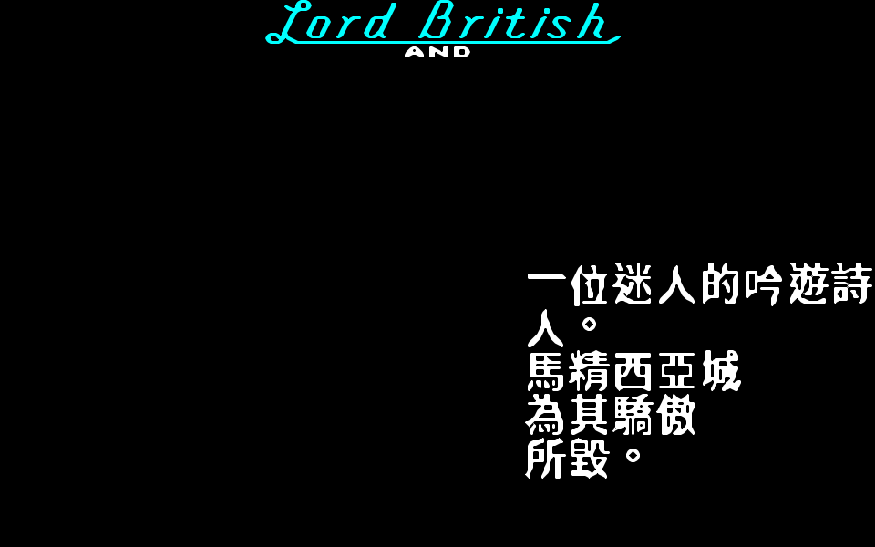
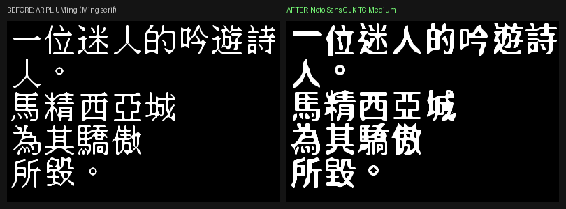

# Ultima IV: Quest of the Avatar 繁體中文化專案

> *Ultima IV: Quest of the Avatar*(1985 Origin Systems）— 以 **xu4** 開源引擎為基礎的繁體中文化工程
> SDL/Allegro 跨平台 ✦ Docker 全程建置 ✦ 文字資料四源已抽取 ✦ **工程進行中**


*xu4(Allegro 5 + Mesa 軟體 GL)於 Docker headless 渲染的標題畫面 — 本專案的決定性 pass/fail loop。*

---

## 目錄

1. [這是什麼](#這是什麼)
2. [為何選 xu4(而非 u4remastered)](#為何選-xu4)
3. [八德 — Avatar 之道的起點](#八德)
4. [快速開始](#快速開始)
5. [目前進度](#目前進度)
6. [技術架構](#技術架構)
7. [資料抽取成果](#資料抽取成果)
8. [Roadmap](#roadmap)
9. [License & Credits](#credits)

---

<a name="這是什麼"></a>
## 🏰 這是什麼

**Ultima IV** 是電玩史上第一款以「**成為道德的化身(Avatar)**」為核心的 RPG —— 沒有大魔王,目標是在真理、愛、勇氣三原則下修練八大美德,走遍八座聖壇,成為 Avatar。

本專案把這款 1985 年的經典,以維護中的開源引擎 **[xu4](https://github.com/xu4-engine/u4)**(Allegro 5 / GLFW 跨平台 C++)為基礎,進行**完整繁體中文化**:跨平台(Linux / Windows)、Docker 全程建置、文字以 load-time 查表替換(對齊 [u6-cht](https://github.com/wicanr2/u6-cht) 的成功經驗)。

> 目前狀態:**引擎建置 + 文字架構盤點 + 資料抽取已完成**;翻譯、CJK 字型、引擎 hook 為後續階段。

---

<a name="為何選-xu4"></a>
## 🧭 為何選 xu4(而非 u4remastered)

本專案最初評估 `MagerValp/u4remastered`,結論是**不適合**:

| | `u4remastered` | **`xu4`(採用)** |
|---|---|---|
| 技術 | **C64 6502 組合語言**(23,101 行 `.s`) | C++ + **Allegro 5 / GLFW** |
| 平台 | 僅 Commodore 64 / VICE | **Linux / Windows / Mac** 原生 |
| 文字編碼 | 單位元組、8×8 charset、**每行 16 字**死巷 | CHARSET + `.txf`(uint16 碼位) |
| 中文化 | 需從零重寫整個引擎 | hook 中央文字漏斗即可 |

`u4remastered` 並未浪費:它的 `src/talk/talk.json`(修過數十個對白 bug 的乾淨 256-NPC 字料)被用作**翻譯底本與對齊 oracle**。完整評估見 [`PLAN.md`](PLAN.md)。

---

<a name="八德"></a>
## 🔮 八德 — Avatar 之道的起點

U4 是「八德系統」的起源。Garriott 把所有德目歸納到三個底層原則 **Truth / Love / Courage**,八大美德是三者的**全部組合**(2³ = 8):

| 美德 | 中文 | 構成 | 真言 | 城市 | 職業 |
|---|---|---|---|---|---|
| Honesty | 誠實 | Truth | **ahm** | 月光城 Moonglow | 法師 |
| Compassion | 慈悲 | Love | **mu** | 不列顛城 Britain | 吟遊詩人 |
| Valor | 勇敢 | Courage | **ra** | 哲倫 Jhelom | 戰士 |
| Justice | 正義 | Truth+Love | **beh** | 紫衫城 Yew | 德魯依 |
| Sacrifice | 犧牲 | Love+Courage | **cah** | 米諾克 Minoc | 技工 |
| Honor | 榮譽 | Truth+Courage | **summ** | 特林希克 Trinsic | 聖騎士 |
| Spirituality | 靈性 | Truth+Love+Courage | **om** | 史卡拉布雷 Skara Brae | 遊俠 |
| Humility | 謙卑 | （三者皆無） | **lum** | 新馬精西亞 New Magincia | 牧人 |

> 譯名沿用台灣《創世紀聖者之書》體系,與 u6-cht 對齊。開場的 gypsy 心理測驗(已抽出 28 題)決定你最契合的美德與起始職業。

---

<a name="快速開始"></a>
## ⚡ 快速開始

完整指令見 [`SETUP.md`](SETUP.md)。最小流程:

```bash
# 1. 取得 xu4 引擎(本 repo 不含上游,clone 重建)
git clone https://github.com/xu4-engine/u4.git xu4
cd xu4 && git submodule update --init --recursive && cd ..

# 2. Docker 建置(Allegro 5;make download 自動抓 freeware U4 資料)
docker build -f docker/Dockerfile.zh -t u4cht/xu4-allegro xu4

# 3. headless 截圖驗證
docker build -f docker/Dockerfile.test -t u4cht/xu4-test docker
mkdir -p /tmp/u4shot
docker run --rm -v /tmp/u4shot:/out u4cht/xu4-test 22 3   # → /tmp/u4shot/screen.png
# shot.sh 預設帶 --filter xBRZ(灰階 CJK AA 最平滑);第 3 參數可自帶 --filter 覆蓋,
# 或附加其他 xu4 args,如:... u4cht/xu4-test 22 3 "--skip-intro"
```

> 原版 U4 資料(`ultima4.zip`)為 Origin © 1985 的 **freeware**,由 `make download` 自動取得,不需手動準備、不入庫。

---

<a name="目前進度"></a>
## 📊 目前進度

| Phase | 內容 | 狀態 |
|---|---|---|
| P0 | 引擎選型決策(改用 xu4 + Allegro 5) | ✅ |
| P1 | Docker 建置 xu4(二進位 + 資料模組) | ✅ |
| P2 | headless 截圖 loop + 文字架構 / 字型可行性 | ✅ |
| P3 | 文字輸出 hook 盤點(H1–H8) | ✅ |
| P4 資料面 | `.TLK` / stringtable / 硬編 / vendor 四源抽取 | ✅ |
| P5 翻譯 | 四源全譯(talk 256 + stringtable 114 + 硬編 318 + vendor 278) | ✅ |
| P6 | CJK 字型 + 接 H1 hook(垂直切片,headless 驗證) | 🔵 PoC 通過 |
| P7+ | 完整 in-game 整合 / format-aware / 跨平台打包 | ⬜ |


*Phase B 驗證:xu4 文字區經真實 `chtLookup`(en→zh)+ **Noto Sans CJK TC** 16×16 點陣字渲染中文 —— 「一位迷人的吟遊詩人。」(Iolo)、「馬精西亞城為其驕傲所毀。」*


*字型可讀性:AR PL UMing(左,Ming serif 細筆)→ Noto Sans CJK TC Medium(右,粗筆均勻)。*


*灰階 AA:二值(左)→ 灰階抗鋸齒(右),`cjkBlit` 以 alpha 混黑底,斜筆/曲線鋸齒減少。*


*放大 filter:預設 `--filter point`(NN,左,AA 邊緣呈方塊)→ `--filter xBRZ`(平滑放大,右)把 AA 補成連續筆畫,最平滑可讀。*

---

<a name="技術架構"></a>
## 🔧 技術架構

xu4 有兩條文字管線(詳見 [`docs/P3-hooks.md`](docs/P3-hooks.md)):

```
A. 遊戲內文字(CHARSET 點陣,中文化主戰場)
   screenMessage ×417 ┐
   NPC 對話 / vendor ─┼─→ H1 screenMessageN ─→ H2 screenShowChar ─→ CHARSET
   screenMessageCenter┘     (換行/tokenize)       (glyph blit)

B. GUI / 選單(.txf SDF 紋理字,uint16 碼位)
   gui_emitText ─→ txf_genText ─→ cfont-*.txf
```

**關鍵收斂**:`screenMessageN` 是遊戲內所有捲動文字(含 NPC 對話)的**單一中央漏斗** —— 對應 u6-cht 的 `MsgScroll::display_string` hook。攻下 H1 + H2(CJK glyph)即覆蓋遊戲主文字面。

**字型策略**:CHARSET 路徑烘 CJK 點陣字庫 + 多格渲染;`.txf` 路徑用 `msdf-atlas-gen` 烘 CJK 子集 + UTF-8 解碼 patch。來源 TTF 用 Noto Sans CJK TC / AR PL UMing。

---

<a name="資料抽取成果"></a>
## 📦 資料抽取成果(P4 資料面)

純資料抽取,**不改引擎**;產物在 [`dumps/`](dumps/),工具在 [`tools/`](tools/):

| 來源 | 機制 | 數量 | 工具 |
|---|---|---|---|
| NPC 對話 | DOS `.TLK`(16 城)→ 對齊 talk.json | **256** NPC × 12 欄 | `extract_tlk.py` |
| intro / codex / shrine | `u4read_stringtable`(title/avatar.exe) | **114** 字串 | `extract_stringtable.py` |
| 硬編 UI / 戰鬥 | `screenMessage` 字面(靜態分析) | **318** 唯一 | `extract_hardcoded.py` |
| vendor 商店對白 | `vendors.b` Boron 腳本 | **278** 唯一 | `extract_vendor_boron.py` |

每份均為 `{en, zh}` 雙語表雛形(`en` 已填 = 引擎實際 lookup key,`zh` 待填)+ 統計/對齊報告。

---

<a name="roadmap"></a>
## 🗺️ Roadmap

1. **翻譯**:填四份 `dumps/*_bilingual.json` 的 `zh`(文白並用,沿用聖者之書譯名 + 共享 glossary)。
2. **CJK 字庫**:烘 CHARSET 點陣字 / `.txf` SDF atlas(只烘實際用到的漢字子集)。
3. **接 hook**:H1 `screenMessageN` load-time 查表 + H2 CJK glyph;binary length-prefixed lookup(byte-safe)。
4. **驗證**:headless 截圖 loop 逐畫面比對(對話 / 選單 / HUD / 戰鬥)。
5. **打包**:Linux + Windows(`Dockerfile.mingw`)。

---

<a name="credits"></a>
## 🙏 License & Credits

- **引擎**:[xu4 — Ultima IV Recreated](https://github.com/xu4-engine/u4)(GPL;Karl Robillard 等維護)。
- **對話字料 oracle**:[MagerValp/u4remastered](https://github.com/MagerValp/u4remastered)(Apache 2.0)的 `talk.json`。
- **原始遊戲**:*Ultima IV* © 1985 Origin Systems / Richard Garriott(freeware,**引擎與資料分離,本 repo 不含遊戲資料**)。
- **前例經驗**:[wicanr2/u6-cht](https://github.com/wicanr2/u6-cht) 的 load-time 替換架構與字型 pipeline。
- **譯名體系**:台灣《創世紀聖者之書》。

> 本 repo 僅納管自有產出(工具 / 雙語表 / Docker / 文件);上游引擎、原始遊戲資料由 `.gitignore` 排除,依 `SETUP.md` 重建。
