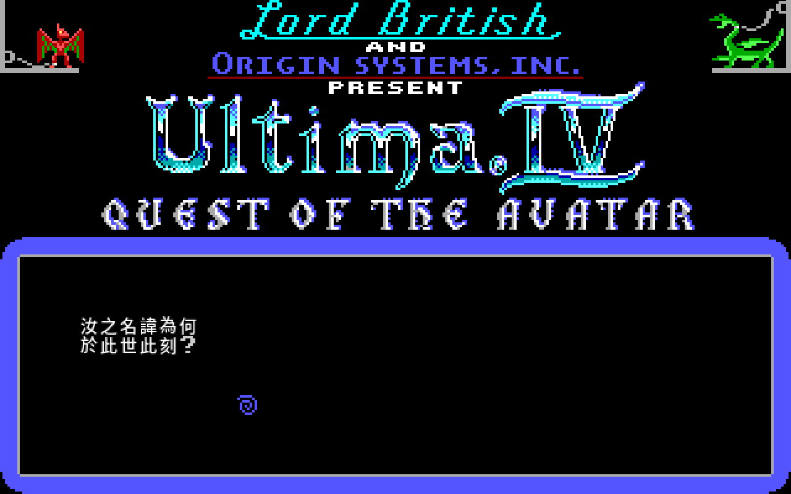
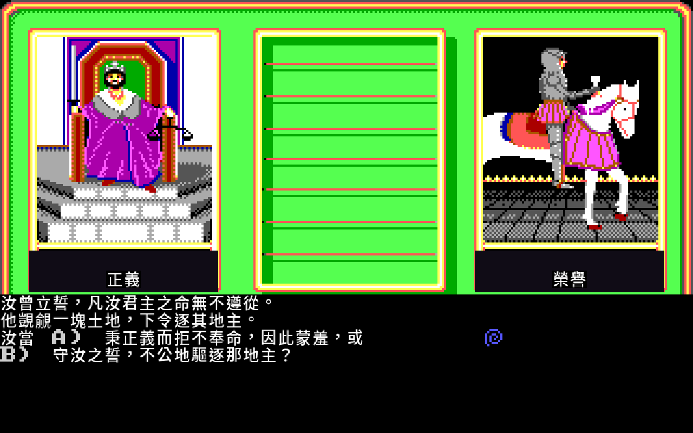
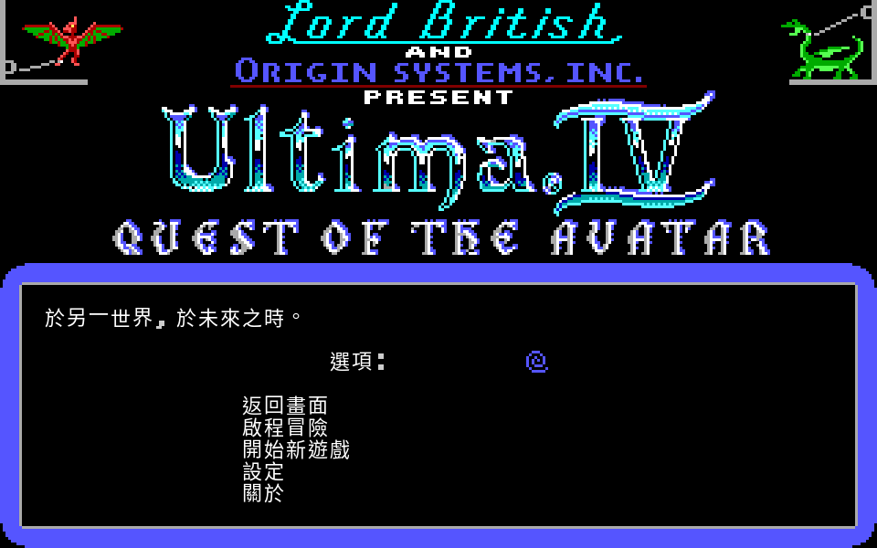
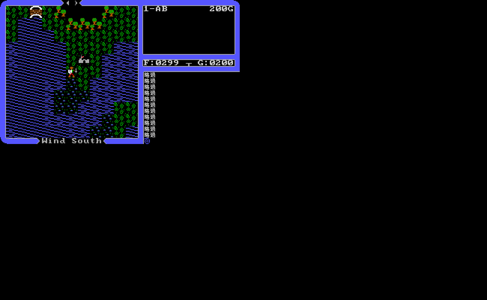
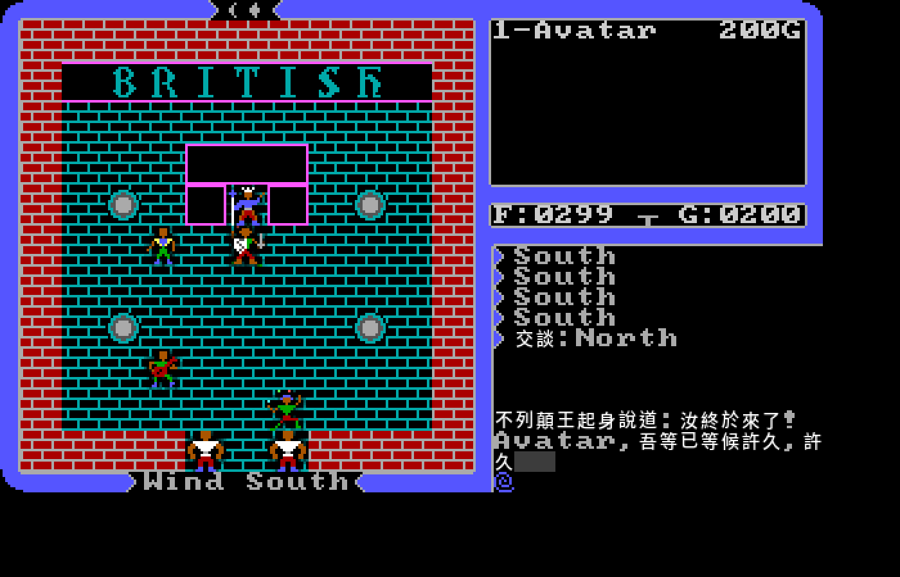
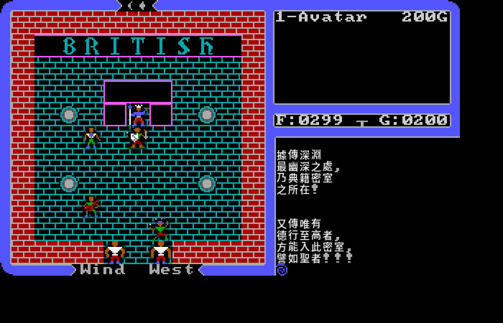
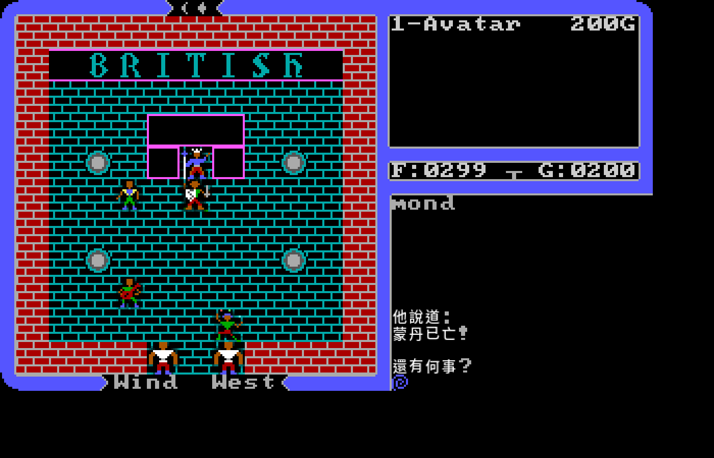
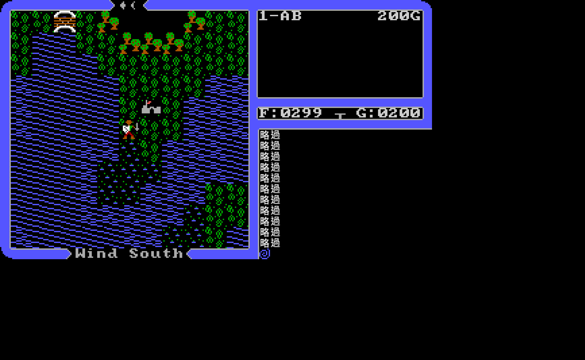

# Ultima IV: Quest of the Avatar — 繁體中文版

> 沒有要打倒的大魔王。沒有公主要救。
> 1985 年,Richard Garriott 問了一個別的遊戲不敢問的問題:**你願不願意,成為一個有德之人?**
>
> 這是 *Ultima IV: Quest of the Avatar* —— 電玩史上第一款把「道德」做成核心機制的 RPG。
>
> 還記得嗎?那年它有太多副面孔 —— EGA、VGA,還有遠在日本的 FM Towns、X68000、MSX2,
> 大海另一端的 Amiga,卡帶裡的 Sega 主機。每一台都是同一個不列顛尼亞,卻沒幾個台灣玩家
> 看全過。本專案以開源引擎 **[xu4](https://github.com/xu4-engine/u4)** 為基礎,把這款四十年的
> 經典**完整繁體中文化**,跨平台(Linux / Windows / macOS)、640×400 全美術重繪;更一路把那七個面貌
> ——畫風與配樂——一張光碟、一片磁碟、一顆 ROM 地挖了回來,讓你按一個 `F2`,就在整部移植史
> 之間穿梭。**這不只是一次漢化,是把一款經典的七個分身,一個個救了回來。**


*Lord British 與 Origin Systems 呈獻 ——「Ultima IV:聖者的追尋」。標題動畫、雙龍、Britannia 地圖,逐幀重現於 640×400。*

---

<a name="gallery"></a>
## 🖼️ 走進不列顛尼亞

> 一個午後,你在自家後院的森林裡迷了路。林間一輛吉普賽篷車,一位老婦人以塔羅牌測你的心性 ——
> 你最契合哪一種美德?於是,旅程開始了。

| 化身命名 —— 汝之名為何 | 命運之牌:勇氣,還是正義? |
|---|---|
|  |  |
| *「汝之名為何,於此世此刻?」化身命名,旅程自此啟封。* | *盟邦受辱席間 —— 汝當勇敢隱忍(勇氣),或起身討一句道歉(正義)?八張牌、七道兩難,問出你的美德與職業。* |

| 主選單 —— 純粹的中文 | 啟程:Britannia 世界地圖 |
|---|---|
|  |  |
| *返回畫面 / 啟程冒險 / 開始新遊戲 / 設定 / 關於 —— 每字一格,乾淨俐落。* | *水波、森林、城堡、隨風而行的你。HUD、風向、訊息欄,全部說中文。* |

> 以上皆為 Docker headless(Allegro 5 + Mesa 軟體 GL)實機渲染截圖,非合成。

---

<a name="lordbritish"></a>
## 🗣️ 謁見不列顛王

走進城堡、登上二樓,向 **Lord British** 詢問世間種種 —— 八德的真義、聖壇所在、冥河大深淵與典籍密室、三位大邪君的下場。整段對白(載自原版 `avatar.exe`)逐句中文化,連初見時喚你之名的問候都不放過。

| 初見:王起身相迎 | 詢問「冥河大深淵」 | 詢問「蒙丹」 |
|---|---|---|
|  |  |  |
| *「不列顛王起身說道:汝終於來了!Avatar,吾等已等候許久,許久……」名字即時帶入。* | *「乃典籍密室之所在!……方能入此密室,譬如聖者!!!」深淵與典籍兩段,忠實分頁。* | *「他說道:蒙丹已亡!」三大邪君,各有交代。* |

> 實機驗證:`goto` 不列顛城堡 → 二樓 Klimb → 謁見 Lord British,逐 keyword 截圖。LB 座標由原版 `LCB_2.ULT` 解出。

---

<a name="art"></a>
## 🎨 兩個時代的美術,一鍵之間 —— `F2`

Ultima IV 當年有 EGA(16 色)與後來社群重製的 VGA(256 色)兩套美術。本專案讓你**在遊戲進行中按 `F2` 即時切換**,同一局、同一個位置,瞬間換皮 —— 隊伍、進度、座標分毫不動。


*遊戲執行畫面(VGA 256 色,全中文 HUD)。遊戲中按 `F2` 即可在同一局、同一座標瞬間切換成 1985 年的 EGA 16 色原味,進度分毫不動。兩套美術的逐磚差異見下方 tileset 對照。*

而那 256 個 tile —— 地形、城堡、Avatar、各路怪物、Britannia 符文字母 —— 兩套全貌並陳:

| EGA tileset(256 tile) | VGA tileset(256 tile) |
|---|---|
|  |  |

*獸人、蝙蝠、巨蛇、飛龍、骷髏、石像鬼、漂浮的眼魔⋯⋯ 從 ankh 聖符記到月相,1983 的想像力盡在其中。(由原版 `SHAPES.EGA` / `shapes.vga` 解碼渲染,工具見 [`tools/render_tilesheet.py`](tools/render_tilesheet.py)。)*

### 不只兩個時代 —— 一場跨平台的考古

EGA 與 VGA 只是開始。U4 在 1985 之後被移植到太多機器,每一台都有自己的一套美術:
1990 年日本的 **FM Towns** 版奢侈地用上 16-bit 直色與 CD 紅皮書配樂、Pony Canyon 的
**MSX2** 磁碟、SHARP **X68000** 的硬碟映像、世嘉 **Master System** 卡帶、**Amiga** 的
五層點陣⋯⋯ 那些畫風大多數台灣玩家當年根本沒機會看到。

於是我們把光碟、磁碟、ROM 一張張挖開,逐一還原各版的 tileset,讓 `F2` 不只在兩個時代、
而是在**整個移植史**之間循環:

| 平台 | 年代 | 狀態 |
|---|---|---|
| EGA / VGA | 1985 / 社群重製 | ✅ 內建,隨時可切 |
| **FM Towns** | 1990(日) | ✅ 完整主題(`ULTIMA4.TIL` 直色 tileset + CD 配樂 + intro);需自備光碟 |
| **Amiga** | 1988 | 🟢 tileset 完整解碼(LZW 解壓 + 內嵌 16 色 palette + 逐列交錯 bitplane,色彩正確:ankh/城堡/船/磚牆);整合中 |
| MSX2 / X68000 | 1987 | 🔬 tileset 已解碼(MSX2 自訂 palette、X68000 用世界地圖當校色 oracle);整合中 |
| **Sega SMS** | 1990 | 🟢 tileset 已取(libretro 模擬器 headless 穿越完整創角到世界地圖、dump VRAM+CRAM、name-table per-tile 上色,色彩正確);方法見 [SMS tileset 提取手記](docs/sms-tileset-extraction.md) |

這些畫風大多不能用「把圖檔切出來」交差。FM Towns 是 16-bit 直色、Amiga 把一張圖拆成五層
位元平面還加了 LZW 壓縮、MSX2 用自家調色盤、X68000 得拿世界地圖當校色的標準答案才確定顏色;
最硬的是 Sega 那台主機 —— 它的卡帶裡根本沒有排好的 tileset,只能讓模擬器一路穿越完整創角、
走進世界地圖,再把顯示記憶體整個倒出來逐格上色。換句話說,每多一種畫風,背後就是一次
獨立的格式破解。能放進 `F2` 那一圈的,都是真的從原始媒體救回來、顏色對得上的版本。

---

<a name="music"></a>
## 🎵 招魂:讓四十年前的晶片再唱一次

美術只是這趟考古的一半。U4 各版的**配樂**,有的是現成的取樣、有的根本是一份「曲譜」,
得連那年代的音效晶片一起請回來,才聽得到聲音。

最淺的一條路是音效。FM Towns 的攻擊 / 魔法 / 馬蹄聲(檔名直接寫著 `Attack1`、`HORSE`)、
X68000 的 OKI ADPCM 樣本、Amiga 那顆 Paula 晶片的 8-bit 音效庫 —— 三家三種格式,全轉成了
現代 WAV。麻煩的是:在沒有喇叭的容器裡跑,你**聽不到**自己解出來的到底是音效還是雜訊。
土辦法最管用 —— **把波形畫成圖,用眼睛驗收**:

```
ATTACK1  ┤▌▌▌▌▌▌▌▌▌▌▌▌▌▌▌▌▌▌▌▌      ▁▁▁   ← 快速振盪(揮砍的嗡嗡聲)
MAHOU1   ┤████████████████▁▁▁▁▁▁▁▁▁▁▁▁     ← 長包絡(施法,約 8 秒尾韻)
HORSE    ┤▌  ▌▌            ▌▌            ← 規律爆發(馬蹄,數得出蹄拍!)
BEEP     ┤▙▟▙▟▙▟▙▟▙▟▙▟▙▟▙▟▙▟▙▟▙▟▙▟▙▟   ← 教科書般的方波(嗶聲)
```

數得出蹄拍、看得到方波,就知道取樣率、格式、起點全對了 —— 這些形狀,湊不出來。方法寫成了
**[各平台音效抽取手記](docs/audio-extraction.md)**。

真正的硬骨頭是**背景音樂**。它不是取樣,是一串「第幾拍、哪個聲部、用什麼音色、彈哪個音」的
指令,得找回當年那顆晶片照著彈才有聲音 —— 而格式沒有任何公開文件。X68000 那條最深:
背景音樂走 **FM 合成**,驅動程式是自家寫的(開頭署名 "YODEL & BIG-X"),曲譜檔 `ult.mgd`
從零逆起 —— 檔頭、音色定義、每條聲部的音符與時值,一格一格拆出來;再把音色參數餵進
**YM2151(OPM)FM 晶片**的模擬器,讓它真的算出聲音。最後,**四十年前那顆晶片,真的又唱了
一次**:多條聲部各自分到通道、依拍子合奏,渲染成一百秒的多聲部 FM。Amiga 版更孤獨 —— 連
Amiga 社群都有人在論壇貼「**WANTED: Ultima IV Amiga Music**」求檔;那份私有序列同樣被逆了
出來,主旋律與低音的線條,在 piano-roll 上清清楚楚是一條連貫的樂句,不是亂跳的雜訊。

要老實說一句:這還不是「和原機一模一樣」的保真版 —— tempo、效果、ADPCM 鼓點還在補,音色
也還在校。但「**讓晶片重新發聲**」這道最難的關,已經過了。整套怎麼逆的,都寫進了
**[X68000 MGD 格式手記](docs/x68000-mgd-format.md)**、**[YM2151 知識庫](docs/ym2151-knowledge-base.md)**
與 **[Amiga 音樂格式手記](docs/amiga-music-format.md)** —— 留給下一個想叫醒老晶片的人。

---

> **引擎與資料分離**:各版美術與音樂是各家的版權資產,**不隨本專案散布**。你需自備
> 各平台的原始媒體;repo 只提供解碼工具與模組定義,偵測到你放進去的資產才會把該主題
> 加進 `F2` 循環,否則優雅跳過。每個平台的格式逆向過程都寫成了可複用的 skill
> (`skills/u4-multiplatform-theme`、`skills/u4-msx2-extract`),給下一個想還原經典的人。

> 另有 **`F3` 切換解析度**(tile 物理放大)與 **三套中文字形**(Noto 黑體 / Firefly 宋體 / Kai 楷體)。見 [遊戲中熱鍵](#hotkeys)。

---

## 目錄

1. [走進不列顛尼亞(畫廊)](#gallery)
2. [謁見不列顛王](#lordbritish)
3. [兩個時代的美術 F2 —— 一場跨平台考古](#art)
4. [招魂:讓四十年前的晶片再唱一次](#music)
5. [這是什麼](#這是什麼)
6. [一款改寫 RPG 的遊戲 —— Ultima IV 的來歷](#歷史)
7. [為何選 xu4(而非 u4remastered)](#為何選-xu4)
8. [八德 — Avatar 之道的起點](#八德)
9. [遊戲中熱鍵](#hotkeys)
10. [快速開始](#快速開始)
11. [目前進度](#目前進度)
12. [技術架構](#技術架構)
13. [資料抽取成果](#資料抽取成果)
14. [Roadmap](#roadmap)
15. [譯名政策(不完全沿用精訊)](#naming)
16. [License & Credits](#credits)

---

<a name="這是什麼"></a>
## 🏰 這是什麼

**Ultima IV** 是電玩史上第一款以「**成為道德的化身(Avatar)**」為核心的 RPG —— 沒有大魔王,目標是在真理、愛、勇氣三原則下修練八大美德,走遍八座聖壇,成為 Avatar。

本專案把這款 1985 年的經典,以維護中的開源引擎 **[xu4](https://github.com/xu4-engine/u4)**(Allegro 5 / GLFW 跨平台 C++)為基礎,進行**完整繁體中文化**:跨平台(Linux / Windows / macOS)、Docker 全程建置、文字以 load-time 查表替換(對齊 [u6-cht](https://github.com/wicanr2/u6-cht) 的成功經驗)。除文字外,還把六種移植版的[美術](#art)與[配樂](#music)從原始媒體逆向還原 —— 下面先講工程,前面兩章是它的成果展。

> 目前狀態:**可玩**。標題 / 選單 / 角色創建 / intro 故事 / NPC 對話 / 系統訊息 / vendor 商店全部中文,640×400 全美術 2x、CJK 一格一字;遊戲中 `F2` 切 EGA/VGA、`F3` 切解析度;Linux AppImage 與 Windows zip 皆已打包(含全部 DLL、遊戲資料、三套字形)。**macOS** 版亦已移植完成 —— Apple Silicon 的自包含 `.app`(zip / dmg)由 GitHub Actions 原生建置、相依庫全 bundle、解壓即玩(Intel 版受 macos-13 runner 供給排隊中)。

---

<a name="歷史"></a>
## 📜 一款改寫 RPG 的遊戲 —— Ultima IV 的來歷

1985 年,Origin Systems 推出 *Ultima IV: Quest of the Avatar*,設計者是 Richard Garriott(遊戲裡的不列顛王 Lord British)。它之所以被反覆寫進遊戲史,不是因為畫面或戰鬥,而是因為它**把 RPG 的目標整個換掉了**。

**在它之前,RPG 就是打倒大魔王。** Ultima 一到三是「黑暗紀元」三部曲:剷除巫師蒙丹(Mondain)、女巫米娜克絲(Minax)、半機械半生物的埃克索達斯(Exodus)。玩家熟悉的套路是變強、屠龍、破關。

**Ultima IV 把這條路堵死了 —— 沒有大魔王可殺。** 一個常被提及的緣由是:前作熱賣的同時,Garriott 收到一些指控遊戲教壞人、宣揚暴力與邪術的來信。他的回應不是辯解,而是反過來問:如果有一款遊戲,獎勵的不是殺戮與掠奪,而是**做一個好人**,會是什麼樣子?於是 Ultima IV 的終局不是擊敗誰,而是讓玩家成為「**Avatar**」—— 八大美德的人格典範。遊戲最深處、冥河大深淵的盡頭,等著你的不是頭目,而是《終極智慧法典》(Codex of Ultimate Wisdom)拋出的一句叩問:美德的本質為何?

**這套理念是用規則撐起來的,不只是包裝。** 八大美德由真理、愛、勇氣三條原動力組合而出(見 [八德](#八德));開場沒有捏數值,而是一位吉普賽女郎用一連串道德兩難的塔羅問題,測出你最契合哪一種美德,據此給你起始職業。進城之後,你的一舉一動都被默默記著:在商店順手牽羊、對 NPC 說謊、戰鬥中臨陣脫逃,都會悄悄折損對應的美德;童叟無欺、濟弱扶傾、見義勇為,才把你一步步推向 Avatar。**遊戲不會明說它在打分,但它一直在看。**

**它開啟了 Ultima 的「啟蒙紀元」。** Ultima IV 到六這組「Avatar 三部曲」自此把八德當作系列的精神主軸,而「用機制衡量玩家品行」這個想法,也成為後世無數 RPG 道德 / 聲望系統的源頭之一。當年的盒裝還附上布質地圖、安卡(Ankh)護身符,以及兩本小冊子《不列顛尼亞之史》與《神秘智慧之書》—— 把玩家拉進世界的，是這些可以捧在手上的東西。

**而這一切,幾乎全長在文字裡。** 八德的教誨不是過場動畫,是你一句一句問出來的 NPC 對話、聖壇的冥想、不列顛王的訓示。換句話說,Ultima IV 的靈魂在它的**文本**——這也正是「把它完整中文化」最值得做的理由:讓這趟關於品格的旅程,對中文玩家同樣讀得懂、走得進去。

> 譯名與背景考據沿用台灣《創世紀聖者之書》(1992,電腦玩家雜誌)所建立的中文體系,並與 [u6-cht](https://github.com/wicanr2/u6-cht) 對齊;事實細節另以 `docs/reference/` 的萃取參考交叉佐證。

---

<a name="為何選-xu4"></a>
## 🧭 為何選 xu4(而非 u4remastered)

本專案最初評估 `MagerValp/u4remastered`,結論是**不適合**:

| | `u4remastered` | **`xu4`(採用)** |
|---|---|---|
| 技術 | **C64 6502 組合語言**(23,101 行 `.s`) | C++ + **Allegro 5 / GLFW** |
| 平台 | 僅 Commodore 64 / VICE | **Linux / Windows / Mac** 原生 |
| 文字編碼 | 單位元組、8×8 charset、**每行 16 字**死巷 | CHARSET + `.txf`(uint16 碼位) |
| 中文化 | 需從零重寫整個引擎 | hook 中央文字漏斗即可 |

`u4remastered` 並未浪費:它的 `src/talk/talk.json`(修過數十個對白 bug 的乾淨 256-NPC 字料)被用作**翻譯底本與對齊 oracle**。完整評估見 [`PLAN.md`](PLAN.md)。

---

<a name="八德"></a>
## 🔮 八德 — Avatar 之道的起點

U4 是「八德系統」的起源。Garriott 把所有德目歸納到三個底層原則 **Truth / Love / Courage**,八大美德是三者的**全部組合**(2³ = 8):

| 美德 | 中文 | 構成 | 真言 | 城市 | 職業 |
|---|---|---|---|---|---|
| Honesty | 誠實 | Truth | **ahm** | 月光城 Moonglow | 法師 |
| Compassion | 慈悲 | Love | **mu** | 不列顛城 Britain | 吟遊詩人 |
| Valor | 勇敢 | Courage | **ra** | 哲倫 Jhelom | 戰士 |
| Justice | 正義 | Truth+Love | **beh** | 紫衫城 Yew | 德魯依 |
| Sacrifice | 犧牲 | Love+Courage | **cah** | 米諾克 Minoc | 技工 |
| Honor | 榮譽 | Truth+Courage | **summ** | 特林希克 Trinsic | 聖騎士 |
| Spirituality | 靈性 | Truth+Love+Courage | **om** | 史卡拉布雷 Skara Brae | 遊俠 |
| Humility | 謙卑 | （三者皆無） | **lum** | 新馬精西亞 New Magincia | 牧人 |

> 譯名沿用台灣《創世紀聖者之書》體系,與 u6-cht 對齊。開場的 gypsy 心理測驗(已抽出 28 題)決定你最契合的美德與起始職業。

---

<a name="hotkeys"></a>
## ⌨️ 遊戲中熱鍵

| 鍵 | 作用 |
|---|---|
| **`F2`** | 即時切換 **EGA ↔ VGA** 美術(同一局,保留進度) |
| **`F3`** | 循環 **解析度 / 縮放**(tile 物理放大) |
| `U4CHT_FONT` | 環境變數切字形:`firefly`(宋)/ `kai`(楷),省略=Noto 黑體 |

> Linux:`U4CHT_FONT=firefly ./u4-cht-x86_64.AppImage`;Windows:`run.bat` 前 `set U4CHT_FONT=kai`。

---

<a name="快速開始"></a>
## ⚡ 快速開始

完整指令見 [`SETUP.md`](SETUP.md)。最小流程:

```bash
# 1. 取得 xu4 引擎(本 repo 不含上游,clone 重建)
git clone https://github.com/xu4-engine/u4.git xu4
cd xu4 && git submodule update --init --recursive && cd ..

# 2. Docker 建置(Allegro 5;make download 自動抓 freeware U4 資料)
docker build -f docker/Dockerfile.zh -t u4cht/xu4-allegro xu4

# 3. headless 截圖驗證
docker build -f docker/Dockerfile.test -t u4cht/xu4-test docker
mkdir -p /tmp/u4shot
docker run --rm -v /tmp/u4shot:/out u4cht/xu4-test 22 3   # → /tmp/u4shot/screen.png
# shot.sh 預設帶 --filter xBRZ(灰階 CJK AA 最平滑);第 3 參數可自帶 --filter 覆蓋,
# 或附加其他 xu4 args,如:... u4cht/xu4-test 22 3 "--skip-intro"
```

> 原版 U4 資料(`ultima4.zip`)為 Origin © 1985 的 **freeware**,由 `make download` 自動取得,不需手動準備、不入庫。

---

<a name="目前進度"></a>
## 📊 目前進度

| Phase | 內容 | 狀態 |
|---|---|---|
| P0 | 引擎選型決策(改用 xu4 + Allegro 5) | ✅ |
| P1 | Docker 建置 xu4(二進位 + 資料模組) | ✅ |
| P2 | headless 截圖 loop + 文字架構 / 字型可行性 | ✅ |
| P3 | 文字輸出 hook 盤點(H1–H8) | ✅ |
| P4 資料面 | `.TLK` / stringtable / 硬編 / vendor 四源抽取 | ✅ |
| P5 翻譯 | 四源全譯(talk 256 + stringtable 114 + 硬編 318 + vendor 278) | ✅ |
| P6 | CJK 字型(Noto Sans CJK TC 灰階 AA)+ 接 H1 hook | ✅ |
| P7 多面 hook | 對話 / 系統訊息 / 選單 / 角色創建 / intro 故事 hook | ✅ |
| **B 640×400** | 全美術 2x regime + CJK 1-cell(menu/prompt/訊息/故事/cinematic 全乾淨) | ✅ |
| 標題動畫 2x | AnimPlot int16 + 元素座標 2x → 標題畫面/選單完美 | ✅ |
| vendor / showText | module 層 vendor 中文化、intro 故事 hook | ✅ |
| **F2 EGA/VGA** | 遊玩中即時切換 graphics 模組(full config swap + map 堆疊 re-point) | ✅ |
| **F3 解析度** | 遊玩中循環 scale(tile 物理放大) | ✅ |
| **模組瀏覽器(GUI SDF)** | `ESC` 設定畫面標題 / 按鈕中文化 —— 自製單通道 SDF CJK 子集塞進 MSDF atlas，引擎加 UTF-8 解碼 + 稀疏碼位查找 | ✅ |
| 打包 | AppImage(靜態 runtime)+ Windows zip(全 DLL + 遊戲資料)+ macOS `.app`(Apple Silicon,zip/dmg,相依庫全 bundle) | ✅ |


*`F3` 切換解析度:同一畫面物理放大,tile 與 HUD 一起變大、更有臨場感。*


*遊戲中 `ESC` 的模組瀏覽器 —— 連這塊走 GPU SDF 紋理字型的設定畫面也中文化:「xu4 ∣ 遊戲模組」「開始 / 離開 / 取消」。模組名為檔名,保留原文。*

---

<a name="技術架構"></a>
## 🔧 技術架構

xu4 有兩條文字管線(詳見 [`docs/P3-hooks.md`](docs/P3-hooks.md)):

```
A. 遊戲內文字(CHARSET 點陣,中文化主戰場)
   screenMessage ×417 ┐
   NPC 對話 / vendor ─┼─→ H1 screenMessageN ─→ H2 screenShowChar ─→ CHARSET
   screenMessageCenter┘     (換行/tokenize)       (glyph blit)

B. GUI / 選單(.txf SDF 紋理字,uint16 碼位)
   gui_emitText ─→ txf_genText ─→ cfont-*.txf
```

**關鍵收斂**:`screenMessageN` 是遊戲內所有捲動文字(含 NPC 對話)的**單一中央漏斗** —— 對應 u6-cht 的 `MsgScroll::display_string` hook。攻下 H1 + H2(CJK glyph)即覆蓋遊戲主文字面。

**字型策略**:CHARSET 路徑烘 CJK 點陣字庫 + 多格渲染;`.txf` 路徑用 `msdf-atlas-gen` 烘 CJK 子集 + UTF-8 解碼 patch。來源 TTF 用 Noto Sans CJK TC / AR PL UMing。

---

<a name="資料抽取成果"></a>
## 📦 資料抽取成果(P4 資料面)

純資料抽取,**不改引擎**;產物在 [`dumps/`](dumps/),工具在 [`tools/`](tools/):

| 來源 | 機制 | 數量 | 工具 |
|---|---|---|---|
| NPC 對話 | DOS `.TLK`(16 城)→ 對齊 talk.json | **256** NPC × 12 欄 | `extract_tlk.py` |
| intro / codex / shrine | `u4read_stringtable`(title/avatar.exe) | **114** 字串 | `extract_stringtable.py` |
| 硬編 UI / 戰鬥 | `screenMessage` 字面(靜態分析) | **318** 唯一 | `extract_hardcoded.py` |
| vendor 商店對白 | `vendors.b` Boron 腳本 | **278** 唯一 | `extract_vendor_boron.py` |

每份均為 `{en, zh}` 雙語表雛形(`en` 已填 = 引擎實際 lookup key,`zh` 待填)+ 統計/對齊報告。

> 文字之外的逆向(各平台 tileset / 音效 / FM 音樂)同樣只放工具與方法、不入版權資料,
> 過程寫成可追溯的知識庫:[SMS tileset](docs/sms-tileset-extraction.md)、[音效抽取](docs/audio-extraction.md)、
> [X68000 MGD](docs/x68000-mgd-format.md)、[YM2151](docs/ym2151-knowledge-base.md)、[Amiga 音樂](docs/amiga-music-format.md)。

---

<a name="roadmap"></a>
## 🗺️ Roadmap

**已完成**:四源全譯(talk 256 / stringtable 114 / 硬編 318 / vendor 278)→ CJK 灰階字庫(Noto / Firefly / Kai)→ H1–H8 文字 hook → 640×400 全美術 2x → 標題動畫 → `F2` EGA/VGA 即時切換 → `F3` 解析度 → AppImage + Windows 打包 → **Lord British 城堡對白**(LCB 二樓,載自 `avatar.exe`)→ **vendor 買賣面板** → **一般 NPC 對話系統**(遇見/look/代名詞 他她它/吾名為/汝欲問/給金幣/加入 — DS_LOOK・DS_PRONOUN hook)→ **HUD 風向/方向**(screenTextAt format 查表)→ **角色面板數值縮寫**(力/敏/智/生/法…)→ **法術名**(甦醒術/神光術…本地表免碰撞)+ 施法錯誤 → **吉普賽角色創建**(框架 + 28 題道德兩難)→ **怪物名拍板**(半獸人/巨鼠/樹妖/巨口妖)→ 職業/物品/方向/系統/戰鬥/聖壇/Codex 訊息 → 精訊官方手冊 OCR 參考 + **混合譯名政策**(見 [譯名政策](#naming))→ **模組瀏覽器 GUI SDF 中文化**(自製單通道 SDF CJK 塞入 MSDF atlas + 引擎 UTF-8/稀疏碼位查找)→ **reagents 術語統一**(材料)→ **吉普賽問答卡德目名中文**(drawCard 疊字遮罩,EGA/VGA 通用,完全蓋住原英文橫幅)→ **進城型別字中文**(`進入城堡/城鎮/村莊/廢墟!`,portal 先 chtLookup 型別引數)→ **多平台美術主題**(`F2` 循環納入 **FM Towns** 完整主題:直色 tileset + CD 配樂 + intro;MSX2 / X68000 tileset 已解碼)。

> **全路徑多行掃描 + headless 實機巡查:玩家可見文字到處正確**(stats/對話/移動/裝備/風向/選單/進城 全中文;唯城內地名招牌等**美術 tile 內嵌字母**與 GPL 授權聲明刻意保留)。

**未來方向**:多平台主題整合收尾(MSX2/X68000 模組 + F2、SMS/Amiga 需模擬器或續逆向)、城內地名招牌 letter-tile 中文化、戰鬥/存讀實機畫面驗證、**macOS Intel 版補件**(macos-13 runner 一有空即補)、譯文潤飾(文白比例與專名一致性的全面校讀)。

> **macOS 原生移植**:上游 xu4 與其音訊庫 faun 本來都沒有 macOS 支援。本專案補上了五層 ——
> 自寫 CoreAudio(AudioQueue)音訊後端、為 faun 訊息層補 Apple 的 `MsgTime` 與 dispatch 版逾時、
> 把建置從壞掉的 `Makefile.macosx` 改走平台中性路徑、OpenGL 改用 Apple 核心 `<OpenGL/gl3.h>`、
> 補齊靜態連結相依與 framework。完整過程見 **[macOS 移植手記](docs/macos-port.md)**。

---

<a name="naming"></a>
## 🏷️ 譯名政策 —— 混合採用,**不完全沿用精訊官方手冊**

本專案參考 1985 年**精訊資訊《創世紀IV》官方繁體中文手冊**(已逐頁 OCR 轉錄於 [`docs/manual/`](docs/manual/)),但**刻意不全盤套用**其譯名,改採「**混合**」策略:

- **採精訊** —— 官方譯名較完整、貼合原意、或更具年代記憶價值時(如 Dagger **短劍**、Flaming Oil **焚油**、Mace **釘頭鎚**、Plate **鎧甲**、Fighter **鬥士**、Tinker **工匠**、Shepherd **牧羊人**、Nightshade **龍葵**、Mandrake **曼陀羅**)。
- **保留現譯** —— 官方舊譯今日讀來生硬或易誤解時(如 Paladin **聖騎士**〔非「武士」,避免與 samurai 混〕、Ranger **遊俠**〔非「流浪者」〕、Crossbow **弩**〔非「弓箭槍」〕、Staff **法杖**、Sword **長劍**)。
- **數值完全忠於原版** —— 武器傷害 / 防具防禦 / 法術 MP 經比對與原版 `AVATAR.EXE` **逐位元組相同**;法術試劑組合與《魔法之書》一致。

> 原則:**正確性 / 直觀 > 純懷舊**。精訊譯本是 1985 年的時代產物,部分用詞在今日語感下偏離原意;故僅在官方譯名同等或更佳時採用。完整逐項決定與理由見 [`docs/manual/術語對照.md`](docs/manual/術語對照.md)。八德與三原則沿用台灣《創世紀聖者之書》體系。

---

<a name="credits"></a>
## 🙏 License & Credits

- **引擎**:[xu4 — Ultima IV Recreated](https://github.com/xu4-engine/u4)(GPL;Karl Robillard 等維護)。
- **對話字料 oracle**:[MagerValp/u4remastered](https://github.com/MagerValp/u4remastered)(Apache 2.0)的 `talk.json`。
- **原始遊戲**:*Ultima IV: Quest of the Avatar* © 1985 Origin Systems / Richard Garriott。EA / Origin 多年前已將其釋出為 **freeware**,可於 [The Ultima Codex](https://ultimacodex.com/) 等處公開取得;本 repo 內的 tileset 展示圖由原版資料解碼渲染,僅供說明。
- **VGA 美術**:U4 Upgrade / Remastered 社群專案。
- **前例經驗**:[wicanr2/u6-cht](https://github.com/wicanr2/u6-cht) 的 load-time 替換架構與字型 pipeline。
- **譯名體系**:八德沿用台灣《創世紀聖者之書》;名詞採「精訊官方手冊 + 現代直觀」混合策略,**不完全沿用精訊**(見[譯名政策](#naming)與 [`docs/manual/術語對照.md`](docs/manual/術語對照.md))。
- **官方手冊**:精訊資訊《創世紀IV》1985 繁中手冊(已 OCR 轉錄於 [`docs/manual/`](docs/manual/),供譯名/數值校對)。

### 🙇 社群貢獻者(由衷感謝)

這份專案能在 macOS / Windows 真機上跑得更穩,要特別感謝這些在自己機器上實測、找出 bug 並送出修正的朋友 —— 沒有你們的真機回饋,這些只在特定平台才現形的問題不會被抓到。感恩 🙏

- **[@catsmice](https://github.com/catsmice)** —— macOS 真機(M1 Pro / macOS 26.5)三項修正([PR #2](https://github.com/wicanr2/u4-cht/pull/2)):CoreAudio 後端改 callback 拉取式(解開頭即靜音 / 城鎮移動卡死)、主選單選項框 2x→3x 偏移、新增本機 Mac 建置腳本 `dist/build-mac-local.sh`。
- **[@laneser](https://github.com/laneser)** —— Windows 音樂 bass 頓頓修正([PR #1](https://github.com/wicanr2/u4-cht/pull/1)):定位為 WASAPI 緩衝在 Windows 預設 15.6ms 計時器精度下週期性 underrun,以 `timeBeginPeriod(1)` 拉高精度根治,附 [`docs/audio-windows.md`](docs/audio-windows.md)。

> repo 納管:中文化工具 / 雙語表 / Docker / 文件 / tileset 展示圖。完整可玩遊戲請依 [`SETUP.md`](SETUP.md) 用 `make download` 自行取得 freeware 資料重建。
